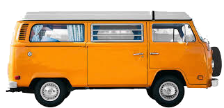

<h1 align="center">
  
   Nautical 
</h1>

<h2 align="center">

### 👋 Hello! I'm Brent (barbacbd) 

I have been developing since I was in highschool (an amount of time I am becoming more scared to admit). I enjoy spending 
most of my time outside with family and friends. The majority of my personal programming experiences are driven by my love of the outdoors. 

I have spent all of my professional career developing on linux systems. I had a strong desire to work for [Red Hat](https://www.redhat.com/en/our-code-is-open?sc_cid=7013a000002q2WoAAI&gclid=EAIaIQobChMI4ufL5cfB-AIVi47ICh3XbQDDEAAYASAAEgKExvD_BwE&gclsrc=aw.ds). In 2022, I jumped at the opportunity to experience life at Red Hat. 

I have experience with python, Go, C, and C++ substantially during my professional career. I also have experience with
languages such as R, Lua, Javascript, Bash, and Java. 

Checkout my simple [portfolio](https://barbacbd.github.io/) for more information!

### ⚡ What is with the VW Bus?

I have a fascination with cars (and so does my son). I love to surf too, and the VW Bus has always been my dream car! It is my goal to save up, buy, and restore a VW Bus. I would like to think that the VW Bus is a nice summary of me, so it is the image/symbol I choose to use.

## 🔭 What am I currently working on ?

- [Nautical](https://github.com/barbacbd/nautical)
- [Local Climate Change Prediction](https://github.com/barbacbd/predictor)

- [Openshift Installer](https://github.com/barbacbd/installer)
- [Openshift Ansible](https://github.com/barbacbd/openshift-ansible)

## 🌱 What am I currently learning

## 👯 I’m looking to collaborate on

- Simulation Environments. I have experience with [NetLogo](https://github.com/NetLogo/NetLogo), so that has been my focus.

- [FEAST](https://github.com/Craigacp/FEAST) - Adding the python extension

- Self Driving/Steering Projects - I spent five years in the field creating autonomous surface vessels. It had a strong impact on my career, and I am always willing to learn and contribute to similar projects. 

- Controller Area Networks (CAN-Bus)

 

<!--
**barbacbd/barbacbd** is a ✨ _special_ ✨ repository because its `README.md` (this file) appears on your GitHub profile.

Here are some ideas to get you started:

- 🔭 I’m currently working on ...
- 🌱 I’m currently learning ...
- 👯 I’m looking to collaborate on ...
- 🤔 I’m looking for help with ...
- 💬 Ask me about ...
- 📫 How to reach me: ...
- 😄 Pronouns: ...
- ⚡ Fun fact: ...
-->
